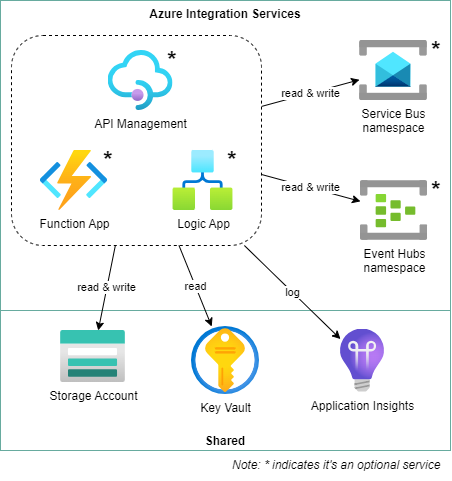

# Azure Integration Services Quickstart

An `azd` template (Bicep) for quickly deploying Azure Integration Services such as **Azure API Management**, **Function App** and **Logic App**, along with supporting resources like **Application Insights**, **Key Vault** and **Storage Account**. This template is ideal for demos, testing or getting started with Azure Integration Services.

## Overview

This template deploys the following resources:

> TODO: Include Azure Service Bus



This template is designed to simplify and accelerate the deployment of Azure Integration Services for:
- Demonstrations
- Testing configurations
- Quick setups for experimentation

To minimize cost and reduce deployment time, the cheapest possible SKUs are used for each service. Virtual networks, application gateways and other security measures typically implemented in production scenarios are not included.


## Getting Started

If you haven't installed the Azure Developer CLI (`azd`) yet, follow the instructions on [Install or update the Azure Developer CLI](https://learn.microsoft.com/en-us/azure/developer/azure-developer-cli/install-azd).

### Deployment

Ones `azd` is installed on your machine, you can deploy this template using the following steps:

1. Run the `azd init` command in an empty directory with the `--template` parameter to clone this template into the current directory.

    ```
    azd init --template ronaldbosma/azure-integration-services-quickstart
    ```

1. Run the `azd auth login` command to authenticate to your Azure subscription _(if you haven't already)_.
  
    ```
    azd auth login
    ```

1. Run the `azd up` command to provision the resources in your Azure subscription. This will deploy both the infrastructure and the sample application (**TODO:** include a sample application). _(Use `azd provision` to only deploy the infrastructure.)_

    ```
    azd up
    ```
   
   You'll be asked to select the Azure Integration Services you want to include in the deployment. Per service, use the arrow keys to select `True` to include it or `False` to skip it, and press `Enter` to continue.  

   

   See [Troubleshooting](#troubleshooting) if you encounter any issues during deployment.

1. Once the deployment is complete, you can locally modify the application or infrastructure and run `azd up` again to update the resources in Azure.

### Clean up

Once your done and want to clean up, run the `azd down` command. By including the `--purge` parameter, you make sure that the API Management service doesn't remain in a soft-deleted state that could block future deployments of the same environment.

```
azd down --purge
```

## Features

- **Integration Services**:
  - Azure API Management (APIM)
  - Azure Function App
  - Azure Logic App (Standard)
- **Shared Resources**:
  - Application Insights for centralized logging and monitoring
  - Azure Key Vault for secure storage of secrets
  - Azure Storage Account for persistent storage
- **Managed Identities**:
  - Each integration service has both a **user-assigned** and **system-assigned managed identity**.
  - These identities are assigned the following roles:
    - Key Vault Secrets User
    - Storage Blob Data Contributor
    - Storage File Data SMB Share Contributor
    - Storage Queue Data Contributor
    - Storage Table Data Contributor
- **Naming Convention**:
  - All resources are deployed using a naming convention based on the [Azure Resource Naming Best Practices](https://learn.microsoft.com/en-us/azure/cloud-adoption-framework/ready/azure-best-practices/resource-naming). 
  - The naming convention is implemented using user-defined functions in Bicep, which I blogged about in [Apply Azure naming convention using Bicep functions](https://ronaldbosma.github.io/blog/2024/06/05/apply-azure-naming-convention-using-bicep-functions/).


The following image displays an example of the resources that are deployed with this template:


## Troubleshooting

### API Management deployment failed because service already exists in soft-deleted state

If you've previously deployed this template and deleted the resources, you may encounter the following error when redeploying the template. This error occurs because the API Management service is in a soft-deleted state and needs to be purged before you can create a new service with the same name.

```
{
    "code": "DeploymentFailed",
    "target": "/subscriptions/00000000-0000-0000-0000-000000000000/resourceGroups/rg-aisquick-dev-nwe-00001/providers/Microsoft.Resources/deployments/apiManagement",
    "message": "At least one resource deployment operation failed. Please list deployment operations for details. Please see https://aka.ms/arm-deployment-operations for usage details.",
    "details": [
        {
            "code": "ServiceAlreadyExistsInSoftDeletedState",
            "message": "Api service apim-aisquick-dev-nwe-00001 was soft-deleted. In order to create the new service with the same name, you have to either undelete the service or purge it. See https://aka.ms/apimsoftdelete."
        }
    ]
}
```

Use the [az apim deletedservice list](https://learn.microsoft.com/en-us/cli/azure/apim/deletedservice?view=azure-cli-latest#az-apim-deletedservice-list) Azure CLI command to list all deleted API Management services in your subscription. Locate the service that is in a soft-deleted state and purge it using the [purge](https://learn.microsoft.com/en-us/cli/azure/apim/deletedservice?view=azure-cli-latest#az-apim-deletedservice-purge) command. See the following example:

```
az apim deletedservice purge --location "norwayeast" --service-name "apim-aisquick-dev-nwe-00001"
```

### Function App deployment failed because of quota limitations

If you already have a Consumption tier (`SKU=Y1`) Function App deployed in the same region, you may encounter the following error when deploying the template. This error occurs because you have reached the region's quota for your subscription.

```
{
  "code": "InvalidTemplateDeployment",
  "message": "The template deployment 'functionApp' is not valid according to the validation procedure. The tracking id is 'fffc2e2d-7c4c-4675-a211-b24cc7795ccf'. See inner errors for details.",
  "details": [
    {
      "code": "ValidationForResourceFailed",
      "message": "Validation failed for a resource. Check 'Error.Details[0]' for more information.",
      "details": [
        {
          "code": "SubscriptionIsOverQuotaForSku",
          "message": "This region has quota of 1 instances for your subscription. Try selecting different region or SKU."
        }
      ]
    }
  ]
}
```

Use the `azd down --purge` command to delete the resources and then deploy the template in a different region.

### Logic App deployment failed because of quota limitations

If you already have a Workflow Standard WS1 tier (`SKU=WS1`) Logic App deployed in the same region, you may encounter the following error when deploying the template. This error occurs because you have reached the region's quota for your subscription.

```
{
  "code": "InvalidTemplateDeployment",
  "message": "The template deployment 'logicApp' is not valid according to the validation procedure. The tracking id is '00000000-0000-0000-0000-000000000000'. See inner errors for details.",
  "details": [
    {
      "code": "ValidationForResourceFailed",
      "message": "Validation failed for a resource. Check 'Error.Details[0]' for more information.",
      "details": [
        {
          "code": "SubscriptionIsOverQuotaForSku",
          "message": "This region has quota of 1 instances for your subscription. Try selecting different region or SKU."
        }
      ]
    }
  ]
}
```

Use the `azd down --purge` command to delete the resources and then deploy the template in a different region.
