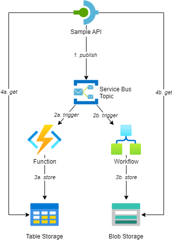
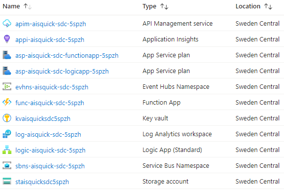

# Azure Integration Services Quickstart - Demo Scenario

In this demo scenario, we will demonstrate how to use Azure Integration Services to build a simple application that uses API Management, Azure Functions, Logic Apps and Service Bus. The application consists of an API that allows a message to be published to a Service Bus topic. A function and a workflow are triggered by the message. The function stores the message in table storage, while the workflow stores the message in blob storage. Using the API, stored messages can be retrieved. See the following diagram for an overview:

## 1. What Resources are getting deployed

For this scenario, you'll need to deploy all optional resources except for the Event Hubs namespace. The following resources will be deployed:

See the [Naming Convention](../readme.md#naming-convention) section in the readme for more information on the naming convention used in this scenario.

## 2. What can I demo from this scenario after deployment

### Publish messages

Follow the [Test](../README.md#test) section in the README to publish a few messages to the Service Bus topic.

### API Management

Show the deployed API and its operations.

1. Navigate to the API Management instance in the Azure portal.  
1. Click the `APIs` tab.  
1. Select the `AISQuick Sample` API.  
1. Review the operations:  
    1. `POST Publish Message`: Publishes a message to the Service Bus topic and returns an ID. This ID can be used in subsequent operations to retrieve the message from storage.  
    1. `GET Blob`: Retrieves a message from blob storage.  
    1. `GET Table Entity`: Retrieves a message from table storage.  

### Service Bus  

Show the Service Bus topic and its subscriptions.  

1. Navigate to the Service Bus namespace in the Azure portal.  
1. Click the `Topics` tab and open the `aisquick-sample` topic.  
1. View the traffic that has passed through the topic in the overview.  
1. Click the `Subscriptions` tab to see the subscriptions created for the Function App and Logic App.  

